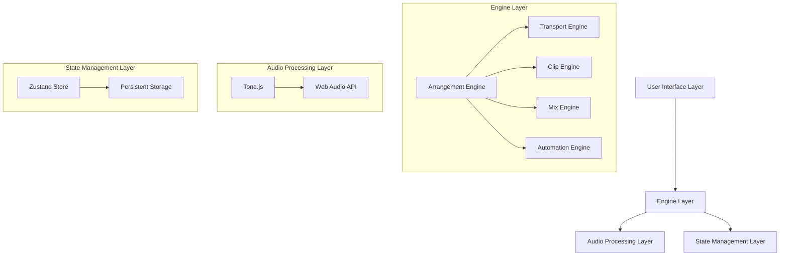
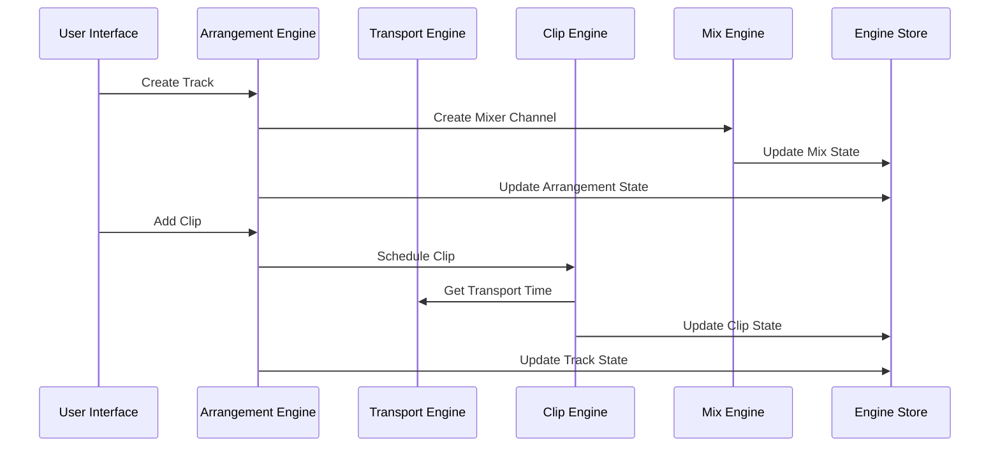
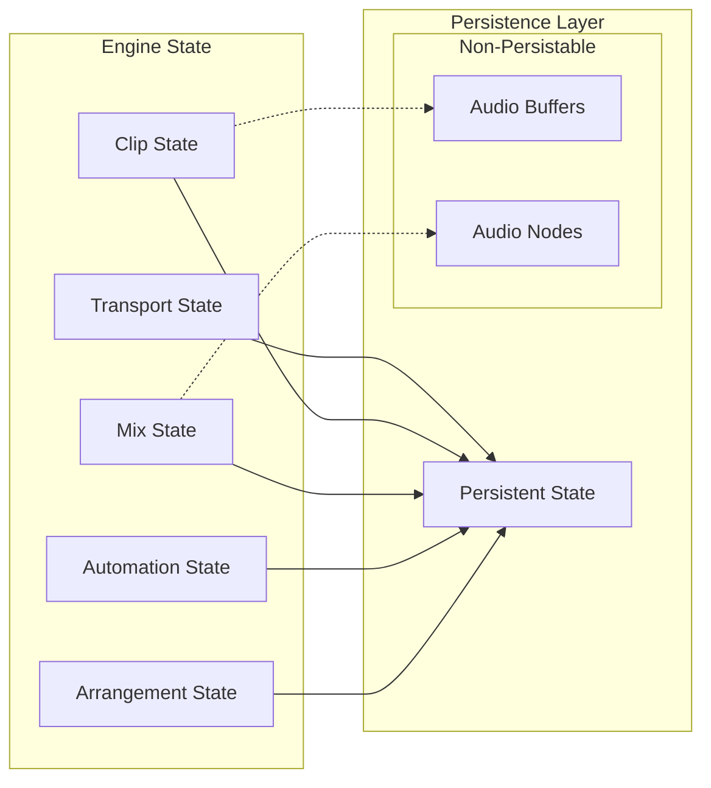
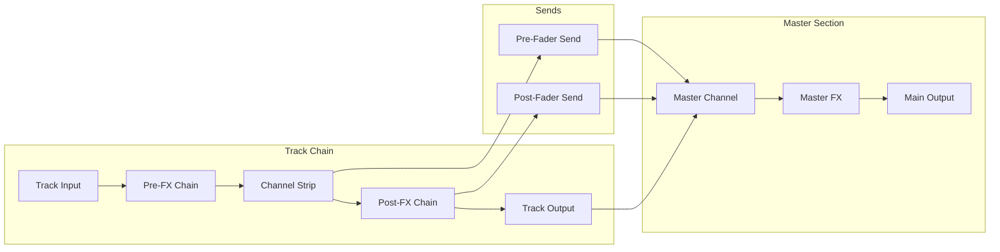

# daw.ts

Work in progress! Very early stage.

Digital Audio Workstation built with [React](https://react.dev/), [tonejs](https://tonejs.github.io/) and [electron](https://www.electronjs.org/)


## Running

- Install dependencies :

```commandline
npm install
```

- Start the UI with :

```commandline
npm run dev
```

The `vite` development server is now accessible `@localhost:5173`.

<details>
  <summary>Electron</summary>
  
  - Start the `electron` development app with :

```commandline
npm run app:dev
```

- Build the electron app with:

```commandline
npm run app electron:build
```

- Clean build files with:

```commandline
npm run clean
```

More building commands are defined in `package.json`.
Currently the electron window needs to have the development server running `@localhost:5173`.

</details>

## Architecture

As the source code is fast moving, the documentation may lag behind a bit.

<details>
  <summary>
    High-level components
  </summary>

The DAW application is built with a layered architecture consisting of:

- User Interface Layer: React components and UI logic
- Engine Layer: Core DAW functionality
- Audio Processing Layer: Audio handling via Tone.js
- State Management Layer: Zustand-based state management

The engine layer consists of five main engines:

1. **Transport Engine**: Handles playback, timing, and tempo
2. **Clip Engine**: Manages audio and MIDI clip content
3. **Mix Engine**: Controls audio routing and processing
4. **Automation Engine**: Handles parameter automation
5. **Arrangement Engine**: Coordinates track organization and timeline



</details>

<details>
  <summary>
    Engine interaction diagram
  </summary>

Engines communicate through:

- Direct method calls for immediate operations
- State updates
- Planned: event system?

This sequence diagram describes the current state of implementation, a lot is missing.



</details>

<details>
  <summary>
    State management flow
  </summary>

Work in progress:

- Uses Zustand for centralized state management
- Separates persistent and non-persistent state
- Maintains atomic updates for consistency
- Handles audio buffer and node references separately



</details>

<details>
  <summary>
    Audio signal flow
  </summary>



</details>
