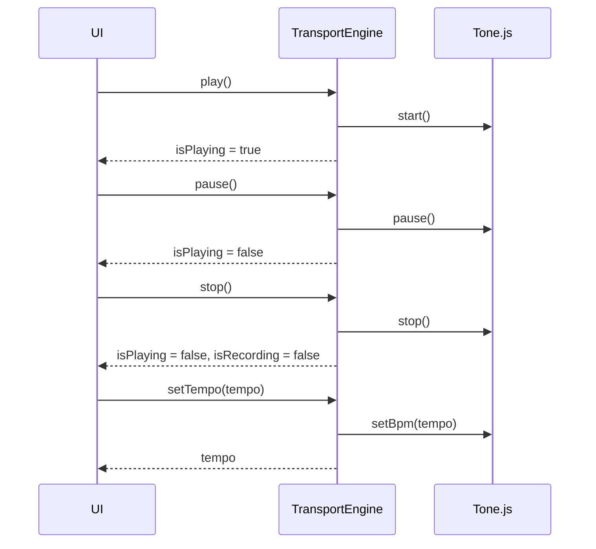
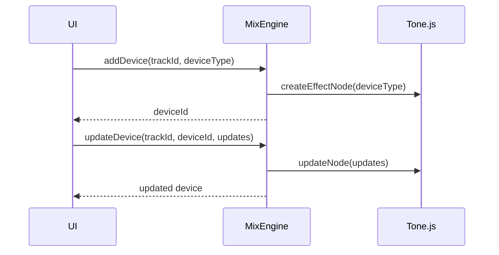
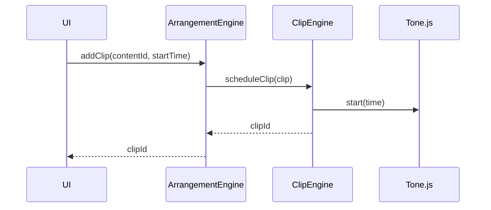
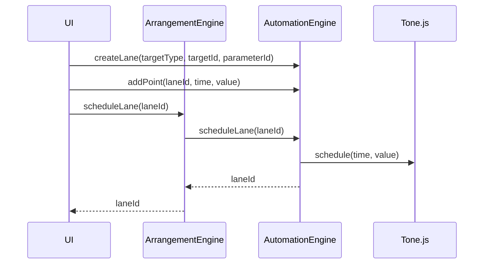
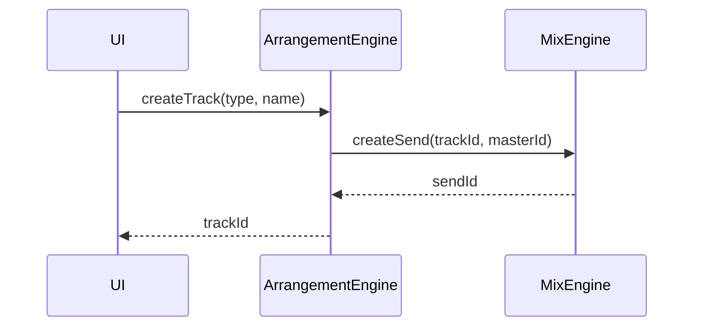
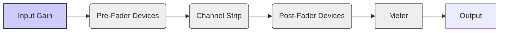
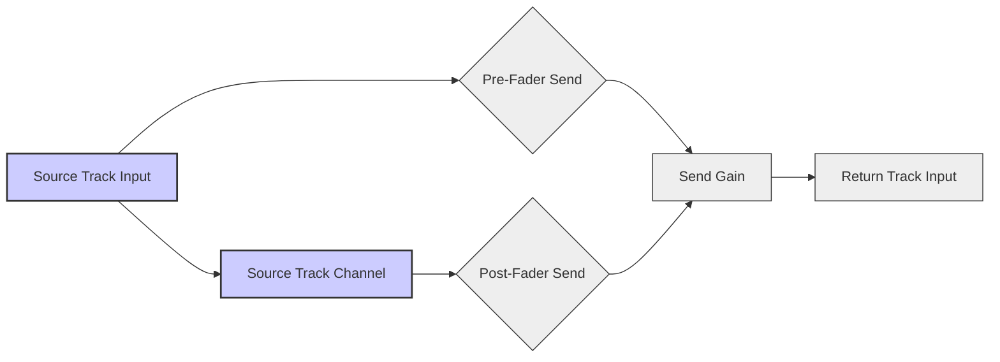
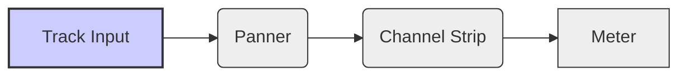
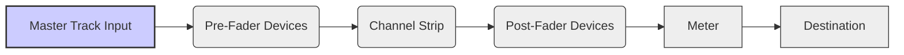

# daw.ts

Work in progress! Very early stage.

`daw.ts` is a Digital Audio Workstation (DAW) application built with TypeScript, [React](https://react.dev/), [Zustand](https://github.com/pmndrs/zustand), and [Tone.js](https://tonejs.github.io/). 


## Features

- A timeline-based view for arranging audio and MIDI clips.
- Real-time audio processing and synthesis with Tone.js
- Drag and drop clips (planned)
- Support for parameter automation (planned), effects, and routing

## Architecture

The application follows a modular architecture with the following key components:

### UI

- Built with React and TypeScript.
- Uses Shadcn UI for styling and layout.
- Includes reusable components for the main application layout, toolbar, and workspace.

### Core

- **Engines:** Manages the different functional engines of the DAW.
  - `EngineManager`: Responsible for instantiating and managing the different engines.
  - `TransportEngine`: Manages transport state (playback, tempo, time signature).
  - `ClipEngine`: Manages clip content and playback state.
  - `MixEngine`: Manages mixer track configuration, device chains, and routing.
  - `AutomationEngine`: Manages automation lanes and parameter connections.
  - `ArrangementEngine`: Manages track organization and timeline state.
- **Stores:** Uses Zustand for state management.
  - `useEngineStore`: Manages the central engine state.
  - `useLayoutStore`: Manages layout-related state (track heights, zoom).
  - `useThemeStore`: Manages the application's theme.
  - `useViewStore`: Manages the current view (arrangement, etc.).
- **Types:** Defines TypeScript types for audio, common, instrument, and parameter data.

### Features

- **Transport:** Includes components and services for transport control.
- **Clips:** Includes components and services for managing audio and MIDI clips.
- **Mix:** Includes components and services for mixer functionality.
- **Automation:** Includes components and services for automation (planned).
- **Arrangement:** Includes components, and services for the arrangement view.

## Data Flow

The application follows a unidirectional data flow:

1.  **User Input:** User interactions in the UI trigger actions.
2.  **Engine Methods:** UI components call methods on the appropriate engine services.
3.  **Tone.js API:** Engine services interact with the Tone.js API for audio processing.
4.  **State Update:** Engine services update the application state using Zustand stores.
5.  **UI Update:** UI components re-render based on the updated state.

## Diagrams (A Thousand Words)

### Engine Interaction

<details>
    <summary>
    Transport Control Interaction
    </summary>



</details>

<details>
    <summary>
    Mixer Device Interaction
    </summary>



</details>

<details>
    <summary>
    Clip Scheduling Interaction
    </summary>



</details>

<details>
    <summary>
    Automation Scheduling Interaction
    </summary>



</details>

<details>
    <summary>
    Track Creation Interaction
    </summary>



</details>

### Audio Signal Flow

<details>
    <summary>
    Mixer Track Signal Flow
    </summary>



</details>

<details>
    <summary>
    Send Routing Signal Flow
    </summary>



</details>

<details>
    <summary>
    Track Signal Flow
    </summary>



</details>

<details>
    <summary>
    Master Track Signal Flow
    </summary>



</details>

## Contributing

Contributions are welcome!

## Getting Started

1. Clone the repository:

```bash
git clone https://github.com/yannmazita/daw.ts.git
```

2. Install dependencies:

```bash
npm install
```

3. Start the application (development server)

```bash
npm run dev
```
