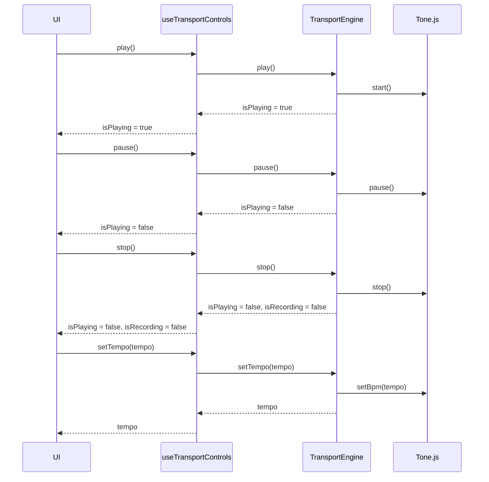
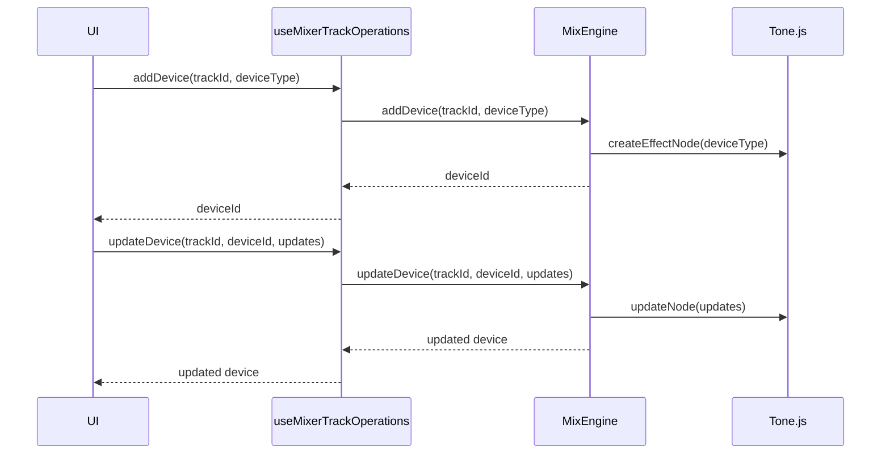
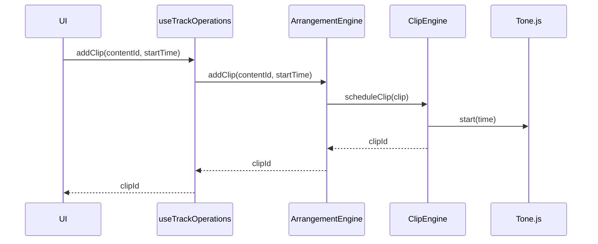
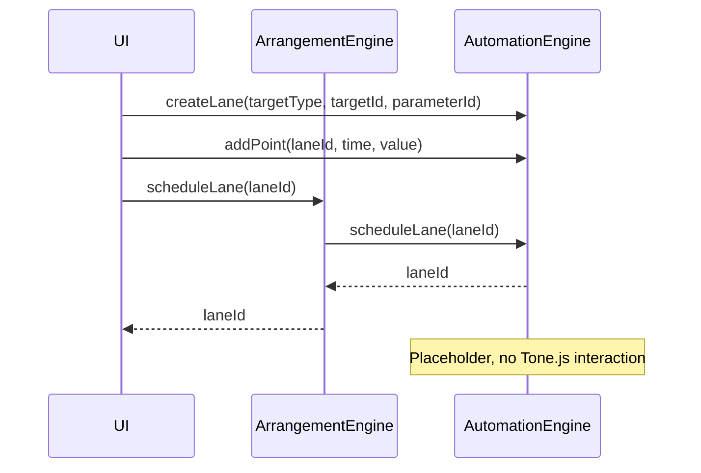
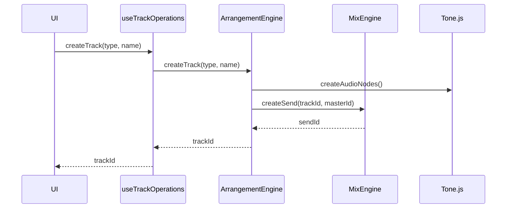
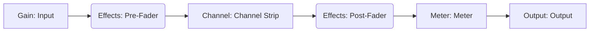
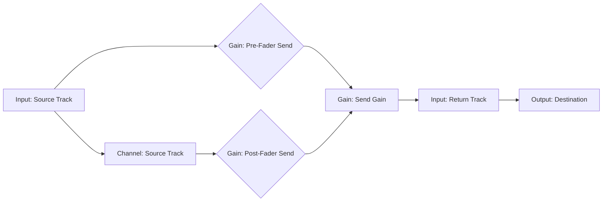
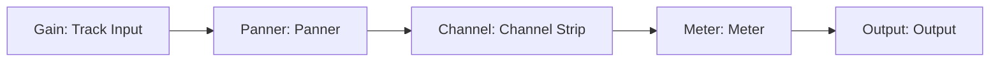
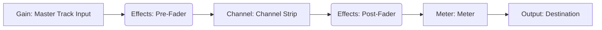

# daw.ts

Work in progress! Very early stage.

`daw.ts` is a Digital Audio Workstation (DAW) application built with TypeScript, [React](https://react.dev/), [Zustand](https://github.com/pmndrs/zustand), and [Tone.js](https://tonejs.github.io/).


## Getting Started

1.  Clone the repository:

    ```bash
    git clone https://github.com/yannmazita/daw.ts.git
    ```

2.  Install dependencies:

    ```bash
    npm install
    ```

3.  Start the application (development server)

    ```bash
    npm run dev
    ```

## Architecture

Because sometimes a picture is worth a thousand words.

### Engine Interaction

<details>
    <summary>
    Transport Control Interaction
    </summary>



</details>

<details>
    <summary>
    Mixer Device Interaction
    </summary>



</details>

<details>
    <summary>
    Clip Scheduling Interaction
    </summary>



</details>

<details>
    <summary>
    Automation Scheduling Interaction
    </summary>



</details>

<details>
    <summary>
    Track Creation Interaction
    </summary>



</details>

### Audio Signal Flow

<details>
    <summary>
    Mixer Track Signal Flow
    </summary>



</details>

<details>
    <summary>
    Send Routing Signal Flow
    </summary>



</details>

<details>
    <summary>
    Track Signal Flow
    </summary>



</details>

<details>
    <summary>
    Master Track Signal Flow
    </summary>



</details>

<details>
    <summary>
    Still maybe a few words on the architecture...
    </summary>

The application logic is made of engines (modules) that allow the application to grow with new features. Each engine has its own logic and state and is initialized by `EngineManager`.
Currently there are 5 engines.

### Arrangement Engine

This engine manages track and clip arrangement in the timeline. It interacts with `MixEngine` and `ClipEngine` to handle sends or playback.

### Automation Engine

_Not implemented yet._ This engine manages automation lanes and paramater connections.

### Clip Engine

This engine manages clips (MIDI clips and audio clips), MIDI file parsing, audio buffers etc.

### Mix Engine

This engine manages mixing, sends, routing etc. Audio processing is done through Tone.js and is extended when needed.

### Transport Engine

This engine manages playback transport, tempo (and tempo tap), time signature, loop settings. Interacts with Tone.js ot control transport state.

</details

## Contributing

Contributions are welcome (and needed)! Features, business logic, UI, tests, optimization, Electron integration etc... there is a lot to do!

Just look at these plain grey rectangles (they are meant to be meters), and empty spaces (they are meant to be features).
