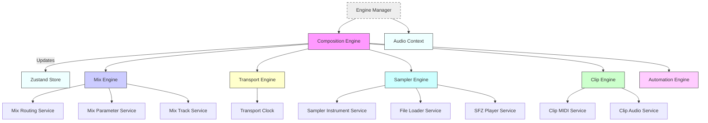
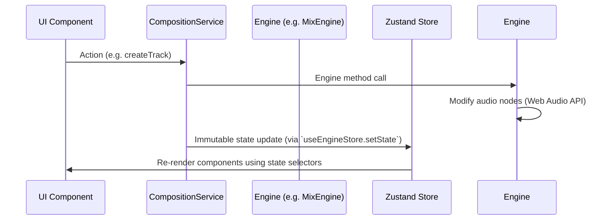

# daw.ts

Work in progress! Very early stage and actively developed.

`daw.ts` is a Digital Audio Workstation (DAW) application built with TypeScript, [React](https://react.dev/), [Zustand](https://github.com/pmndrs/zustand), and leveraging the [Web Audio browser API](https://developer.mozilla.org/en-US/docs/Web/API/Web_Audio_API).

Designed for high-performance audio processing with live editing capabilities.


## Getting Started

1.  Clone the repository:

    ```bash
    git clone https://github.com/yannmazita/daw.ts.git
    ```

2.  Install dependencies:

    ```bash
    npm install
    ```

3.  Start the application (development server)

    ```bash
    npm run dev
    ```

## Architecture

<details>
    <summary>
    Engine Layer Diagram
    </summary>



</details>

<details>
    <summary>
    State Management
    </summary>



</details>

<details>
    <summary>
    Conceptual Audio Graph Diagram
    </summary>

Each input/output node is a Gain node allowing to update gain.

```mermaid
graph LR
    subgraph MasterTrack
        MT_Input(Master Input) --> MT_Pan(Pan)
        MT_Pan --> MT_Gain(Gain)
        MT_Gain --> MT_Output(Destination)
    end

    subgraph Track["Track (MIDI/Audio)"]
        Track_Input(Track Input) --> BypassCheck{SoundChain Active?}
        BypassCheck -- Yes --> SC_Input
        BypassCheck -- No --> Track_Pan(Pan)
        SC_Output --> Track_Pan
        Track_Pan --> Track_Output(Track Output)

        Track_InstrumentInput([Instrument Input - MIDI or Audio]) --> Track_Input
        Track_ClipOutput([Clip Output - Audio or MIDI]) --> Track_InstrumentInput

    end

    subgraph SoundChain
        SC_Input(SoundChain Input) --> Chain1_Input
        subgraph Chain1["Chain 1"]
            Chain1_Input(Input) --> Chain1_Instrument["Instrument (SamplerEngine)"]
            Chain1_Instrument --> Chain1_Effects{Effects}
            Chain1_Effects --> Chain1_Pan(Pan)
            Chain1_Pan --> Chain1_Output(Output)
        end
        Chain1_Output --> Chain2_Input

        subgraph Chain2["Chain 2"]
            Chain2_Input(Input) --> Chain2_Instrument["Instrument (SamplerEngine)"]
            Chain2_Instrument --> Chain2_Effects{Effects}
            Chain2_Effects --> Chain2_Pan(Pan)
            Chain2_Pan --> Chain2_Output(Output)
        end
        Chain2_Output --> ChainN_Input

        subgraph ChainN["Chain n"]
            ChainN_Input(Input) --> ChainN_Instrument["Instrument (SamplerEngine)"]
            ChainN_Instrument --> ChainN_Effects{Effects}
            ChainN_Effects --> ChainN_Pan(Pan)
            ChainN_Pan --> ChainN_Output(Output)
        end
        ChainN_Output --> SC_Output(SoundChain Output)
    end

    subgraph ReturnTrack
        RT_Input(Return Input) --> RT_Pan(Pan)
        RT_Pan --> RT_Output(Return Output)
    end

    subgraph Send
        Send_Output(Send Output)
    end

    %% Main Mix Routing
    Track_Output --> MT_Input
    RT_Output --> MT_Input
    Send_Output --> RT_Input

    style MasterTrack fill:#f9f,stroke:#333,stroke-width:2px
    style Track fill:#ccf,stroke:#333,stroke-width:2px
    style SoundChain fill:#cff,stroke:#333,stroke-width:2px
    style Chain1 fill:#cfc,stroke:#333,stroke-width:2px
    style Chain2 fill:#cfc,stroke:#333,stroke-width:2px
    style ChainN fill:#cfc,stroke:#333,stroke-width:2px
    style ReturnTrack fill:#ffc,stroke:#333,stroke-width:2px
    style Send fill:#fcc,stroke:#333,stroke-width:2px
    style Track_InstrumentInput dashed
    style Track_ClipOutput dashed
```



</details>

<details>
    <summary>
    Detailed Engine description
    </summary>

### Composition Engine

- Orchestrates all engine interactions, provides unified API for the UI.
- Dedicated services for engines.

### Automation Engine

_Not fully implemented yet._ Responsibilites not yet defined, it should handle automation lanes.

### Clip Engine

- MIDI and audio clip management.
- Clip scheduling.
- Dedicated services for MIDI clips and Audio clips.

### Mix Engine

- Handles audio routing and signal processing
- Track, send, and return management.
- Complex instruments and effects with chains and sound chains.
- Dedicated services for routing, parameter control and track lifecycle management.

### Sampler Engine

- SFZ instrument loading/parsing
- Sample pooling with LRU caching
- Dedicated services for sample loading/caching, SFZ region handling and instrument instance management.

### Transport Engine

- High-precision scheduling.
- Tempo and time signature control.
- Dedicated clock service.

</details>

## Development Roadmap

### Current Focus

- MIDI event routing system
- Clip transport synchronization
- Sample-accurate scheduling

### Planned

- FileSystemDirectoryHandle fallback as only FileWithDirectoryAndFileHandle (Blink) is properly used.
- Automation
- UI enhancements

</details>

## Contributing

Contributions are welcome! Current priority areas:

- MIDI scheduling
- Automation
- Performance optimization
