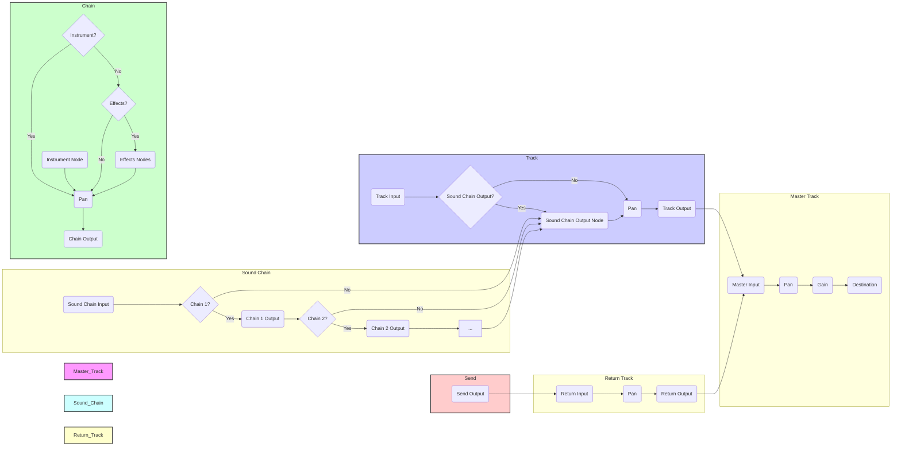
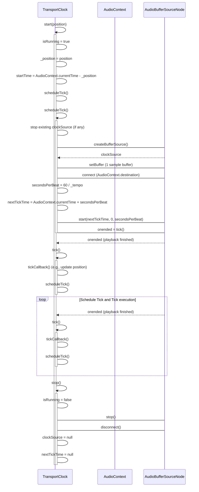
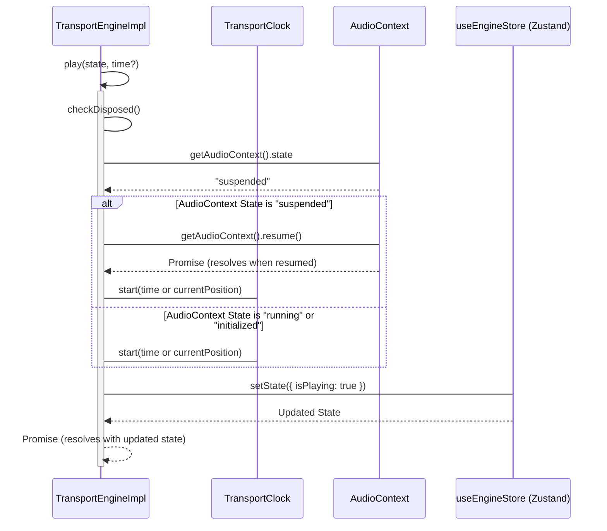
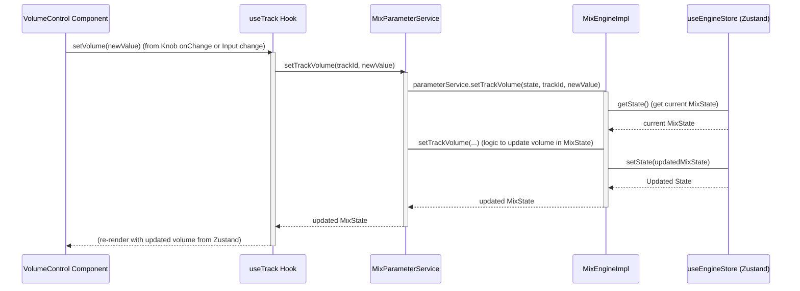
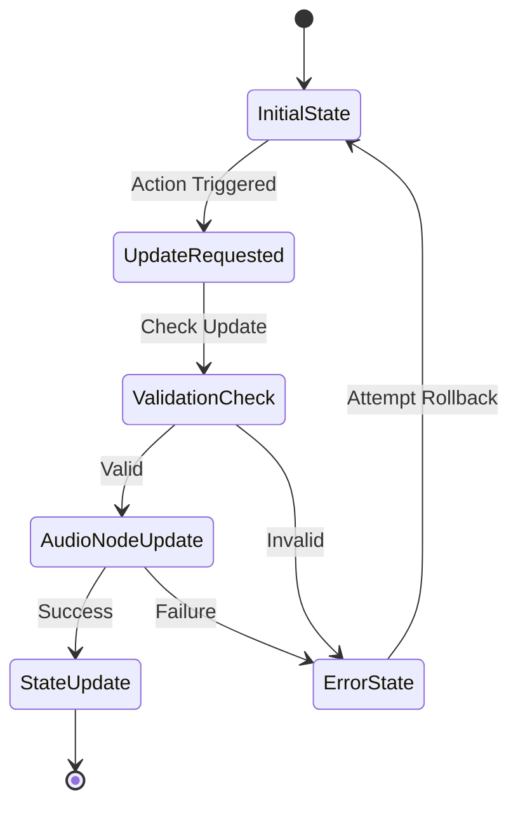

# daw.ts

Work in progress! Very early stage.

`daw.ts` is a Digital Audio Workstation (DAW) application built with TypeScript, [React](https://react.dev/), [Zustand](https://github.com/pmndrs/zustand), and leveraging the [Web Audio browser API](https://developer.mozilla.org/en-US/docs/Web/API/Web_Audio_API).

It aims to be performant and extensible for audio production in the browser.


## Getting Started

1.  Clone the repository:

    ```bash
    git clone https://github.com/yannmazita/daw.ts.git
    ```

2.  Install dependencies:

    ```bash
    npm install
    ```

3.  Start the application (development server)

    ```bash
    npm run dev
    ```

## Architecture

Because sometimes a picture is worth a thousand words.

### Audio Signal Flow

<details>
    <summary>
    Conceptual Audio Graph Diagram
    </summary>



</details>

<details>
    <summary>
    Transport Clock Tick Scheduling
    </summary>



</details>

<details>
    <summary>
    Transport Engine Playback Start
    </summary>



</details>

### Engine Interaction

<details>
    <summary>
    Example of state update sequence (VolumeControl Component)
    </summary>



</details>

<details>
    <summary>
    State Update Lifecycle
    </summary>

The intended lifecycle, more often than not validation and rollback are not (yet) implemented.



</details>

<details>
    <summary>
    Still maybe a few words on the architecture...
    </summary>

The application logic is made of engines with dedicated services that allow the application to grow with new features. The engines read a state object then return an updated state object, the service layer finally commits the changes meaning only one update is necessary. This is done immutably, the only side effects are runtime related.

Currently there are 7 engines.

### Composition Engine

This engine is the orchestrator for all other engines, it is the sole interface for the UI and has dedicated services for each engine.

### Track Engine

This engine manages track creation and manipulation (volume, pan, routing, metering etc).

### Automation Engine

_Not fully implemented yet._ This engine manages automation lanes and paramater connections.

### Clip Engine

_Not fully implemented yet._ This engine manages clips (MIDI clips and audio clips).

### Mix Engine

This engine manages mixing, sends, routing, sound chains etc. Audio processing is done through Tone.js and is extended when needed.

### Sampler Engine

_Not fully implemented yet._ This engine manages SFZ instrument loading/caching, sampling playback

### Transport Engine

This engine manages playback transport, tempo (and tempo tap), time signature, loop settings. Interacts with Tone.js ot control transport state.

</details>

## Contributing

Contributions are welcome (and needed), there is a lot to do!
