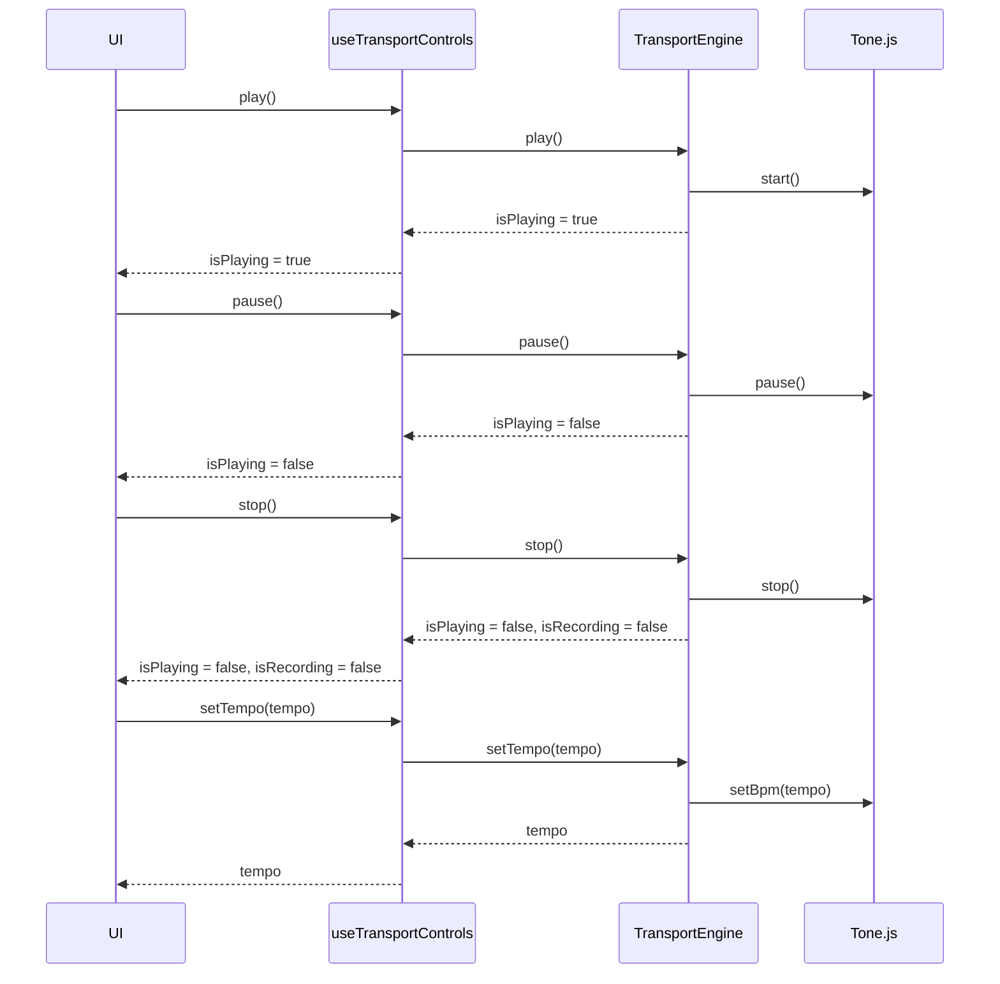
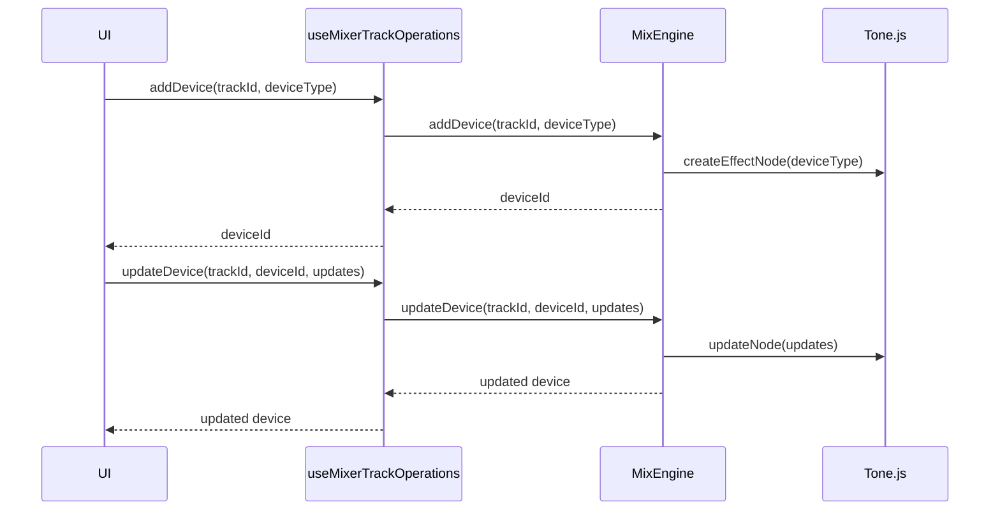
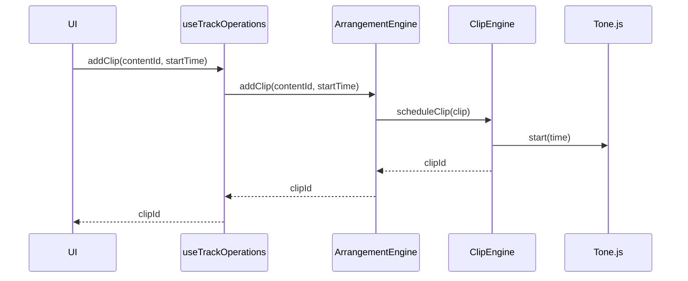
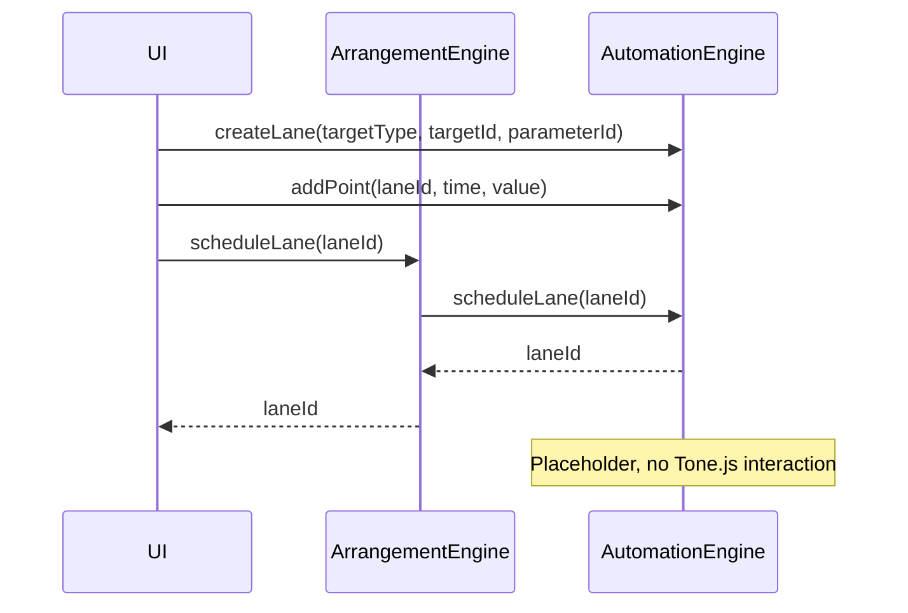
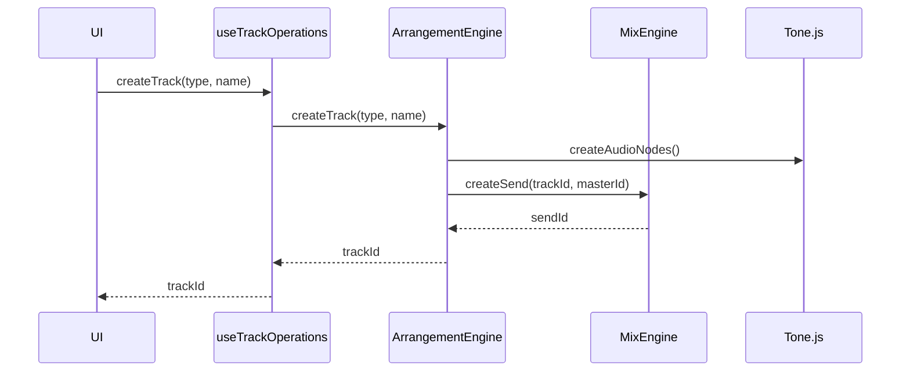
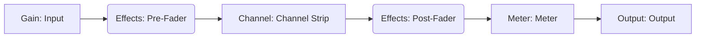
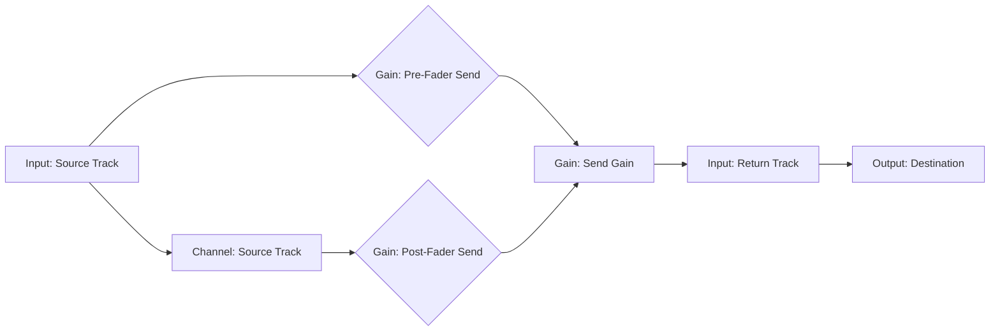
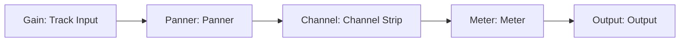
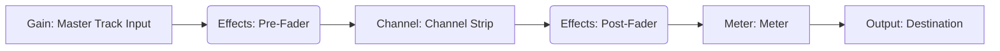

# daw.ts

Work in progress! Very early stage.

`daw.ts` is a Digital Audio Workstation (DAW) application built with TypeScript, [React](https://react.dev/), [Zustand](https://github.com/pmndrs/zustand), and [Tone.js](https://tonejs.github.io/).


## Introduction

`daw.ts` is a Digital Audio Workstation (DAW) application designed to be easy to use and accessible. It is built with a (hopeful) focus on performance to allow for live editing capabilities. The application is currently in an early stage of development, with several features still under construction.

This documentation is intended for developers and contributors who want to understand the project's architecture, components, and functionality.

## Project Setup

### Dependencies

The following are the key dependencies used in this project:

- **React:** A JavaScript library for building user interfaces.
- **TypeScript:** A superset of JavaScript that adds static typing.
- **Tone.js:** A Web Audio framework for creating interactive music in the browser.
- **Zustand:** A small, fast, and scalable bearbones state-management solution.
- **Shadcn UI:** A collection of accessible and reusable UI components.

### Getting Started

1.  Clone the repository:

    ```bash
    git clone https://github.com/yannmazita/daw.ts.git
    ```

2.  Install dependencies:

    ```bash
    npm install
    ```

3.  Start the application (development server)

    ```bash
    npm run dev
    ```

## Architecture

### Engine-Based Architecture

The application follows a modular, engine-based architecture. Each feature (arrangement, clips, mix, transport, automation) has its own engine responsible for managing its logic and state.

### Engine Manager

The `EngineManager` is responsible for initializing and managing the different engine modules. It uses the singleton pattern to ensure that only one instance of each engine exists.

### State Management

[Zustand](https://github.com/pmndrs/zustand) is used for state management. It provides a simple and efficient way to handle application state. The `persist` middleware is used to persist state to local storage, allowing the application to remember the user's settings and data across sessions.

### Data Flow

The application follows a unidirectional data flow:

1.  **User Input:** User interactions in the UI trigger actions.
2.  **Engine Methods:** UI components use hooks to call methods on the appropriate engine services.
3.  **Tone.js API:** Engine services interact with the Tone.js API for audio processing.
4.  **State Update:** Engine services update the application state using Zustand stores.
5.  **UI Update:** UI components re-render based on the updated state.

### Audio Processing

[Tone.js](https://tonejs.github.io/) is used for all audio processing, synthesis, and scheduling. It provides a high-level API for working with the Web Audio API, making it easier to create complex audio applications.

## Component Breakdown

### Common Components

- **`Layout`**: Provides the basic layout structure for the application, including the header and main content areas. It also manages the theme of the application.
- **`Knob`**: A custom knob component for parameter control. It allows users to adjust values by dragging the knob or using the mouse wheel.
- **`BottomSection`**: A placeholder component for the bottom section of the UI.
- **`Shadcn UI`**: A collection of accessible and reusable UI components used for styling and layout.

### Feature Components

- **Arrangement**
  - **`TimelineGrid`**: Renders the timeline grid for arranging audio and MIDI clips. It displays the tracks and their corresponding clips.
  - **`TrackHeader`**: Renders the header for a track, including controls for muting, soloing, arming, panning, and volume.
  - **`TrackLane`**: Renders a single track lane, which contains the clips for that track.
- **Automation**
  - _Currently a placeholder for future development._ The intended role is to provide a way to automate parameters over time.
- **Browser**
  - _Currently a placeholder for future development._ The intended role is to provide a file browser for importing audio and MIDI files.
- **Clips**
  - **`Clip`**: Renders a single clip in the arrangement view. It displays the clip's name and allows users to interact with it.
- **Mix**
  - **`MixerControls`**: Renders the mixer controls, including track units and mixer units.
  - **`MixerUnit`**: Renders a single mixer unit, which contains controls for panning, volume, muting, and soloing.
  - **`TrackUnit`**: Renders a single track unit, which contains controls for panning, volume, muting, soloing, and arming.
- **Transport**
  - **`PlaybackControls`**: Provides the main playback controls, including play, pause, stop, tempo, and time signature.
  - **`LoopControls`**: Provides controls for enabling/disabling the loop mode and setting the loop points.
  - **`TempoTap`**: Provides a button for tapping the tempo.
  - **`TimeSignatureControl`**: Provides controls for changing the time signature.

## Engine Breakdown

### Arrangement Engine

The `ArrangementEngine` manages the arrangement of tracks and clips. It is responsible for creating, deleting, moving, and updating tracks, as well as scheduling and unscheduling clips. It interacts with the `ClipEngine` to manage clip playback, the `MixEngine` to manage track sends and with Tone.js to create audio nodes for each track. It manages the track _state_ and the _timeline_ state.

### Automation Engine

_Currently a placeholder for future development._ The intended role is to manage automation lanes and parameter connections, but it does not yet have full functionality.

### Clip Engine

The `ClipEngine` manages the creation, scheduling, and manipulation of audio and MIDI clips. It is responsible for parsing MIDI files, creating audio buffers, scheduling clips for playback, and managing clip properties like loop points, gain, and fades.

### Mix Engine

The `MixEngine` manages the mixing of audio signals. It is responsible for creating mixer tracks, adding devices to tracks, managing sends, and routing audio signals. It interacts with the `ArrangementEngine` to manage track sends and with Tone.js for audio processing.

### Transport Engine

The `TransportEngine` manages the playback transport. It is responsible for controlling playback, tempo, time signature, loop settings, and tap tempo. It interacts with Tone.js to control the transport state.

## State Management

The application state is managed using [Zustand](https://github.com/pmndrs/zustand). The following stores are used:

- **`useEngineStore`**: Manages the central engine state, including the state of the transport, clips, mix, automation, and arrangement.
- **`useThemeStore`**: Manages the application's theme (light/dark).

The `persist` middleware is used to persist the state to local storage. The `partialize` option is used to only persist the necessary data and avoid storing large objects like audio buffers.

However, persisted state saving/loading needs a deeper focus.

## File Structure

- **`src/`**: The root directory containing all source code.
- **`src/App.tsx`**: The main application component.
- **`src/common/`**: Contains common components, hooks, and utilities.
  - **`src/common/components/`**: Contains reusable UI components.
  - **`src/common/shadcn/`**: Contains components and utilities related to the Shadcn UI library.
- **`src/core/`**: Contains the core logic of the application.
  - **`src/core/engines/`**: Contains the engine modules.
  - **`src/core/stores/`**: Contains the Zustand stores.
  - **`src/core/types/`**: Contains TypeScript types.
- **`src/features/`**: Contains the different features of the application.
  - **`src/features/arrangement/`**: Contains components, hooks, services, types, and utilities related to the arrangement feature.
  - **`src/features/automation/`**: Contains components, services, types, and utilities related to the automation feature.
  - **`src/features/browser/`**: Contains components and hooks related to the browser feature.
  - **`src/features/clips/`**: Contains components, services, types, and utilities related to the clips feature.
  - **`src/features/mix/`**: Contains components, hooks, services, types, and utilities related to the mix feature.
  - **`src/features/transport/`**: Contains components, services, types, and utilities related to the transport feature.
- **`src/index.css`**: Global CSS file.
- **`src/main.tsx`**: Entry point for the React application.
- **`src/vite-env.d.ts`**: TypeScript type declaration file for Vite.

## Diagrams (A Thousand Words)

### Engine Interaction

<details>
    <summary>
    Transport Control Interaction
    </summary>



</details>

<details>
    <summary>
    Mixer Device Interaction
    </summary>



</details>

<details>
    <summary>
    Clip Scheduling Interaction
    </summary>



</details>

<details>
    <summary>
    Automation Scheduling Interaction
    </summary>



</details>

<details>
    <summary>
    Track Creation Interaction
    </summary>



</details>

### Audio Signal Flow

<details>
    <summary>
    Mixer Track Signal Flow
    </summary>



</details>

<details>
    <summary>
    Send Routing Signal Flow
    </summary>



</details>

<details>
    <summary>
    Track Signal Flow
    </summary>



</details>

<details>
    <summary>
    Master Track Signal Flow
    </summary>



</details>

## Contributing

Contributions are welcome (and needed)! Features, business logic, UI, tests, optimization, Electron integration etc there is a lot to do!
